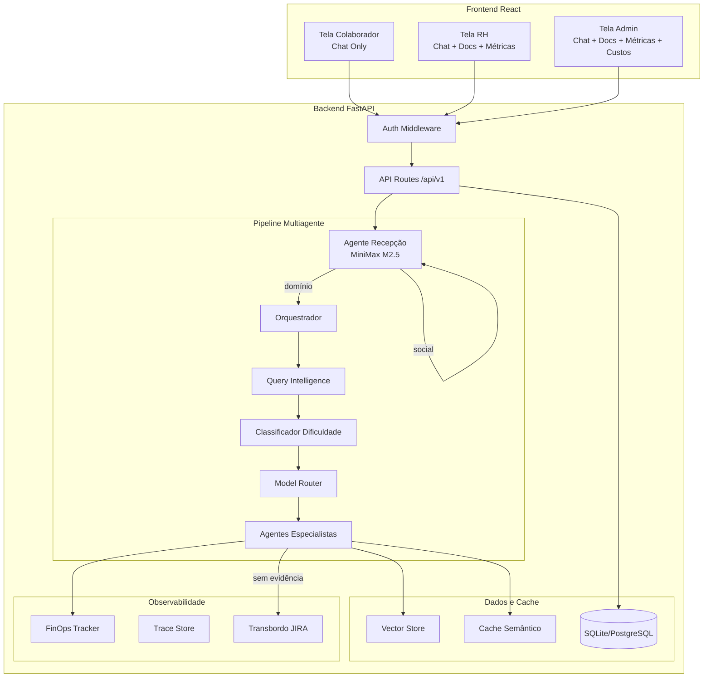

# Design — Assistente Conversacional de RH

## Visão Geral

Evolução do harness de avaliação existente para um assistente conversacional funcional de RH. O sistema reutiliza a arquitetura multiagente já implementada (recepção, orquestrador, especialistas), adicionando:

1. **Classificador de dificuldade por dicionário** — substitui/complementa o risco do model router atual com uma classificação simples baseada em termos
2. **Frontend com telas por perfil** — substitui a interface Streamlit única por um frontend React com rotas separadas por perfil (colaborador, RH, admin)
3. **Mecanismo de transbordo via JIRA** — formaliza o escalonamento humano existente com geração de links JIRA
4. **Dashboards de métricas** — expõe os dados já coletados pelo FinOps em painéis visuais

## Arquitetura



## Componentes e Interfaces

### 1. Classificador de Dificuldade (`app/agents/difficulty_classifier.py`)

Novo módulo que classifica perguntas em 3 níveis usando dicionários de termos.

```python
class DifficultyLevel(StrEnum):
    FACIL = "facil"
    INTERMEDIARIO = "intermediario"
    DIFICIL = "dificil"

@dataclass
class DifficultyClassification:
    level: DifficultyLevel
    matched_terms: list[str]
    reason: str

def classify_difficulty(query: str) -> DifficultyClassification:
    """Classifica a dificuldade da pergunta usando dicionários de termos."""
    ...
```

**Lógica de classificação:**

- Prioridade: difícil > intermediário > fácil
- Se termos sensíveis/complexos são encontrados → difícil
- Se termos de complexidade média são encontrados → intermediário
- Se apenas termos simples são encontrados → fácil
- Se nenhum termo é encontrado → intermediário (default)

**Dicionários:**

- `_EASY_TERMS`: termos de perguntas factuais simples (férias, vale, horário, etc.)
- `_MEDIUM_TERMS`: termos que exigem interpretação (promoção, banco de horas, política, etc.)
- `_HARD_TERMS`: termos sensíveis que exigem cuidado (assédio, demissão, processo, etc.)

### 2. Model Router Adaptado (`app/core/model_router.py`)

O model router existente já mapeia tiers (econômico/intermediário/robusto). A adaptação introduz uma nova função que aceita `DifficultyLevel` como entrada:

```python
def select_model_by_difficulty(
    difficulty: DifficultyLevel,
    *,
    catalog: dict[ModelTier, ModelSpec] | None = None,
) -> RoutingDecision:
    """Seleciona modelo usando a classificação de dificuldade por dicionário."""
    ...
```

Mapeamento:

- `FACIL` → `ModelTier.ECONOMICO` (MiniMax M2.5)
- `INTERMEDIARIO` → `ModelTier.INTERMEDIARIO` (GPT-4o-mini)
- `DIFICIL` → `ModelTier.ROBUSTO` (GPT-4o)

### 3. Mecanismo de Transbordo (`app/escalation/jira_escalation.py`)

Novo módulo para geração de links JIRA quando o sistema não consegue responder:

```python
@dataclass
class EscalationTicket:
    jira_url: str
    reason: str
    domain: str | None
    trace_id: str
    created_at: datetime

def create_escalation(
    query: str,
    reason: str,
    *,
    domain: str | None = None,
    trace_id: str = "",
    base_jira_url: str = "",
) -> EscalationTicket:
    """Gera um link JIRA de escalonamento para a equipe de RH."""
    ...
```

### 4. API de Métricas (`app/api/routes/metrics.py`)

Novas rotas para alimentar os dashboards:

```python
# GET /api/v1/metrics/summary — resumo geral (todos os perfis autorizados)
# GET /api/v1/metrics/tokens — uso de tokens por período
# GET /api/v1/metrics/costs — custos por modelo/período (apenas admin)
# GET /api/v1/metrics/sessions — contagem de sessões
# GET /api/v1/metrics/escalations — total de transbordos
```

### 5. Gestão de Documentos (`app/api/routes/documents.py`)

Expandir a rota existente de ingestão com operações CRUD completas:

```python
# POST /api/v1/documents — adicionar documento (rh, admin)
# PUT /api/v1/documents/{source_id} — editar documento (rh, admin)
# DELETE /api/v1/documents/{source_id} — remover documento (rh, admin)
# GET /api/v1/documents — listar documentos (rh, admin)
# GET /api/v1/documents/{source_id}/versions — histórico de versões
```

### 6. Frontend React (`streamlit/` → migração parcial ou app React separado)

**Estrutura de telas:**

| Rota     | Perfil      | Componentes                                                |
| -------- | ----------- | ---------------------------------------------------------- |
| `/chat`  | colaborador | ChatWindow, MessageList, InputBar                          |
| `/rh`    | rh          | ChatWindow, DocumentManager, MetricsDashboard (sem custos) |
| `/admin` | admin       | ChatWindow, DocumentManager, MetricsDashboard (completo)   |

**Componentes principais:**

- `ChatWindow` — interface de chat com histórico
- `DocumentManager` — CRUD de documentos da base de conhecimento
- `MetricsDashboard` — painéis de tokens, sessões, perguntas, transbordos
- `CostDashboard` — painel de custos (apenas admin)

## Modelos de Dados

### DifficultyClassification

```python
@dataclass
class DifficultyClassification:
    level: DifficultyLevel          # facil | intermediario | dificil
    matched_terms: list[str]        # termos que geraram a classificação
    reason: str                     # explicação legível
```

### EscalationTicket

```python
@dataclass
class EscalationTicket:
    jira_url: str                   # URL do ticket JIRA gerado
    reason: str                     # motivo do escalonamento
    domain: str | None              # domínio de RH (se identificado)
    trace_id: str                   # ID do trace para correlação
    created_at: datetime            # timestamp
```

### MetricsSummary

```python
@dataclass
class MetricsSummary:
    total_sessions: int
    total_questions: int
    total_escalations: int
    total_tokens: int
    total_cost: float               # visível apenas para admin
    tokens_by_period: dict[str, int]
    cost_by_model: dict[str, float]
    escalations_by_reason: dict[str, int]
```

### DocumentVersion (extensão do modelo existente)

```python
@dataclass
class DocumentVersion:
    source_id: str
    version: str
    title: str
    changed_by: str
    changed_at: datetime
    action: str  # "created" | "updated" | "deleted"
```

## Propriedades de Corretude

_Uma propriedade é uma característica ou comportamento que deve se manter verdadeiro em todas as execuções válidas de um sistema — essencialmente, uma declaração formal sobre o que o sistema deve fazer. Propriedades servem como ponte entre especificações legíveis por humanos e garantias de corretude verificáveis por máquina._

### Property 1: Classificação de dificuldade é total e determinística

_Para qualquer_ string de entrada, o Classificador_Dificuldade deve retornar exatamente um dos três níveis (fácil, intermediário, difícil), e para a mesma entrada deve sempre retornar o mesmo nível.

**Validates: Requirements 3.1, 3.2, 3.3, 3.4, 3.5**

### Property 2: Prioridade do classificador de dificuldade

_Para qualquer_ query que contenha termos de múltiplos dicionários, o Classificador_Dificuldade deve classificar pelo nível mais alto presente (difícil > intermediário > fácil).

**Validates: Requirements 3.2, 3.3, 3.4**

### Property 3: Mapeamento dificuldade → modelo

_Para qualquer_ nível de dificuldade, o Model_Router deve selecionar o tier correto: fácil→econômico, intermediário→intermediário, difícil→robusto.

**Validates: Requirements 4.1, 4.2, 4.3**

### Property 4: Fallback de modelo indisponível

_Para qualquer_ modelo marcado como indisponível, o Model_Router deve selecionar um modelo alternativo disponível (nunca retornar um modelo indisponível quando outros estão disponíveis).

**Validates: Requirements 4.4**

### Property 5: Recepção não intercepta mensagens de domínio

_Para qualquer_ mensagem que contenha palavras-chave de domínio de RH, o Agente_Recepção deve retornar None (não interceptar), permitindo que a mensagem siga para o orquestrador.

**Validates: Requirements 1.3**

### Property 6: Recepção intercepta mensagens sociais

_Para qualquer_ mensagem composta exclusivamente de termos sociais (saudações, agradecimentos, despedidas) sem sinais de domínio de RH, o Agente_Recepção deve retornar uma resposta sem acionar retrieval.

**Validates: Requirements 1.2**

### Property 7: Respostas com evidência citam fontes

_Para qualquer_ resposta gerada com evidências recuperadas, a resposta deve incluir referências (título e versão do documento fonte) para cada evidência utilizada.

**Validates: Requirements 5.2, 5.4**

### Property 8: Transbordo registra motivo e gera link

_Para qualquer_ escalonamento acionado, o sistema deve registrar o motivo no trace E gerar um link JIRA válido contendo informações da query.

**Validates: Requirements 6.1, 6.2, 6.3**

### Property 9: Controle de acesso por perfil

_Para qualquer_ requisição a uma rota protegida feita por um perfil não autorizado, o sistema deve retornar HTTP 403. Especificamente: colaborador em rotas admin → 403; RH em rota de custos → 403.

**Validates: Requirements 11.2, 11.3**

### Property 10: Ingestão completa de documentos

_Para qualquer_ documento válido submetido por um usuário autorizado (RH ou admin), o sistema deve realizar parsing, chunking e indexação, resultando em chunks pesquisáveis no vector store.

**Validates: Requirements 8.7, 9.2, 10.1**

### Property 11: Remoção de documento invalida chunks e cache

_Para qualquer_ documento removido, os chunks associados não devem mais aparecer em resultados de busca, e entradas de cache que referenciem esses chunks devem ser invalidadas.

**Validates: Requirements 10.3, 9.5**

### Property 12: Versionamento de documentos preserva histórico

_Para qualquer_ sequência de operações (criar, editar, editar) em um documento, o histórico de versões deve conter todas as versões anteriores em ordem cronológica.

**Validates: Requirements 10.4**

### Property 13: Documentos inválidos são rejeitados

_Para qualquer_ documento vazio ou inválido submetido ao sistema, a submissão deve ser rejeitada com uma mensagem de erro descritiva e nenhum chunk deve ser criado.

**Validates: Requirements 10.5**

### Property 14: Histórico de mensagens em ordem cronológica

_Para qualquer_ sequência de mensagens em uma sessão, a exibição deve manter a ordem cronológica de envio (mais antiga primeiro).

**Validates: Requirements 7.2**

### Property 15: Contabilização de transbordos no dashboard

_Para qualquer_ transbordo acionado, o contador de escalonamentos no dashboard de métricas deve ser incrementado em exatamente 1.

**Validates: Requirements 6.4**

## Tratamento de Erros

| Cenário                        | Ação                                                                 |
| ------------------------------ | -------------------------------------------------------------------- |
| Modelo LLM indisponível        | Fallback para próximo tier disponível; log de warning                |
| Classificação sem termos       | Default para intermediário; continua o fluxo                         |
| Nenhuma evidência encontrada   | Mensagem de limitação + transbordo JIRA                              |
| Documento inválido na ingestão | Rejeição com erro 422 + mensagem descritiva                          |
| Perfil não autorizado          | HTTP 403 com mensagem genérica (sem leak de info)                    |
| Falha na geração de link JIRA  | Log de erro; resposta com mensagem de limitação sem link             |
| Cache corrompido/indisponível  | Bypass; gera resposta normalmente sem cache                          |
| Timeout de LLM                 | Retry com backoff; após 3 tentativas, fallback para modelo mais leve |

## Estratégia de Testes

### Abordagem Dual

O projeto utiliza tanto testes unitários quanto testes baseados em propriedades (property-based testing):

- **Testes unitários (pytest):** Exemplos específicos, edge cases, integrações
- **Testes de propriedade (Hypothesis):** Propriedades universais com geração aleatória de inputs

### Biblioteca de Property-Based Testing

**Hypothesis** (Python) — biblioteca padrão para PBT em Python, já compatível com pytest.

### Configuração

- Mínimo 100 iterações por teste de propriedade (`@settings(max_examples=100)`)
- Cada teste de propriedade deve referenciar a propriedade do design com tag:
  - Formato: `# Feature: assistente-conversacional-rh, Property N: <texto>`

### Cobertura de Testes

| Componente                   | Unitários                          | Propriedades      |
| ---------------------------- | ---------------------------------- | ----------------- |
| Classificador de dificuldade | Edge cases (string vazia, unicode) | Properties 1, 2   |
| Model router (by difficulty) | Exemplos concretos                 | Properties 3, 4   |
| Agente de recepção           | Saudações específicas              | Properties 5, 6   |
| Geração de resposta          | Resposta com/sem evidência         | Property 7        |
| Transbordo JIRA              | Formato do link                    | Property 8        |
| Controle de acesso           | Cada combinação perfil/rota        | Property 9        |
| Ingestão de documentos       | Documento válido/inválido          | Properties 10, 13 |
| Remoção de documentos        | Cleanup de chunks                  | Property 11       |
| Versionamento                | Sequência de edits                 | Property 12       |
| Métricas/Dashboard           | Contagem de escalations            | Property 15       |
| Histórico de chat            | Ordenação de mensagens             | Property 14       |
